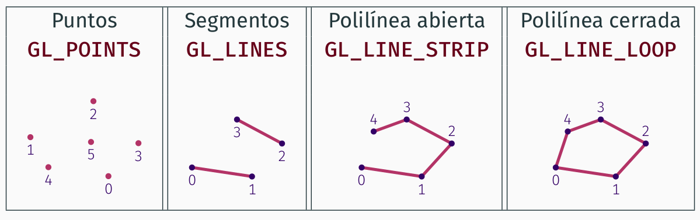
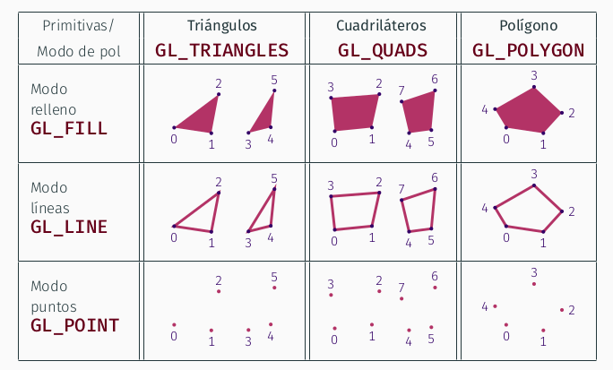
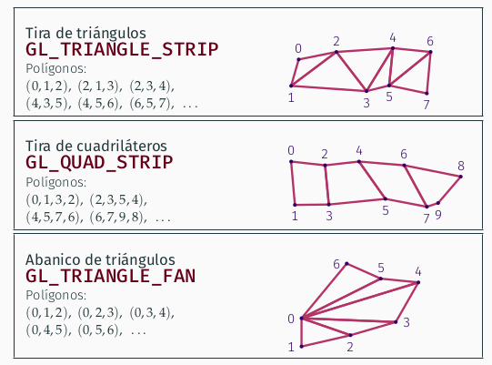

# Manual de Informática Gráfica #
## Tema 1 ##

El proceso de visualización produce una imagen a partir de un modelo de escena y unos parámetros:

**Modelo de escena**: estructura de datos en memoria que representa lo que se quiere ver, esta formado por varias partes:
- Modelo geométrico: conjunto de primitivas (típicamente polígonos planos), que definen la forma de los objetos a visualizar.
- Modelo de aspecto: conjunto de parámetros que definen el aspecto de los objetos: tipo de material, color, texturas, fuentes de luz, etc.

**Parámetros de visualización**: es un conjunto amplio de valores que determinan como se visualiza la escena en la imagen, algunos elementos esenciales son:
- Cámara virtual: posición, orientación y ángulo de visión del observador ficticio que vería la escena como aparece en la imagen.
- Viewport: resolución de la imagen, y, si procede, posición de la misma en la ventana.

**Visualización basada en rasterización**

<code>
inicializar el color de todos los pixels

para cada primitiva P del modelo a visualizar

  - encontrar el conjunto S de pixels cubiertos por P
  - para cada pixel q de S:
    - calcular el color de P en q
    - actualizar el color de q
</code>

Las primitivas son los elementos más pequeños que pueden ser visualizados (típicamente triángulos en 3D, aunque pueden ser otros: polígonos, puntos, segmentos de recta, cículos, etc...).

La complejidad en tiempo es claramente del orden del número de primitivas (n) por el número de pixels (p) (tiempo en O(n·p)).

**Visualización basada en Ray-Tracing**

<code>
inicializar el color de todos los pixels

para cada pixel q de la imagen a producir

  - calcular T, el conjunto de primitivas que cubren q
  - para cada primitiva P del conjunto T
    - calcular el color de P en q
    - actualizar el color de q
</code>

**Cauce gráfico**: conjunto de etapas de cálculo que permiten la síntesis de imágenes por rasterización.
- Las entradas al cauce gráfico se denominan primitivas. Una primitiva es una forma visible que no se puede descomponer en otros más simples.
- Un vértice es un punto del espacio 2D o 3D, extremo de una arista de un triángulo, o de un segmento de recta, o donde se dibuja un punto. Una o varias primitivas se especifican mediante una lista de coordenadas de vértices, más alguna información adicional.
- El cauce escribe en el framebuffer, que es una zona de memoria donde se guardan uno o varios arrays con los colores RGB de los pixels de la imagen (y alguna información adicional). Está conectado al monitor.

**Rasterización**: para cada primitiva, se calcula que pixels tienen su centro cubierto por ella.

**Sombreado**: (*shading*) se usan los atributos de la primitiva para asignar color a cada pixel que cubre.

**Etapas del cauce gráfico**
El cauce gráfico tiene las siguientes etapas:

1. **Procesado de vértices**: parte de una secuencia de vértices (puntos del espacio) y produce una secuencia de primitivas (puntos, segmentos o triángulos). Tiene estas sub-etapas:
   1. **Trasnformación**: los vértices de cada primitiva son transformados en diversos pasos hasta encontrar su proyección en el plano de la imagen. Es realizado por un sub-programa llamado **Vertex Shader** (modificacble por el programador, o programable).
   2. **Teselación y nivel de detalle**: transformaciones adicionales avanzadas, realizadas por varios programas, entre ellos el **geometry shader** (programable).
2. **Post-procesado de vértices y montaje de primitivas** incluye varios cálculos como el recortado (*clipping*) y el cribado de caras (*face culling*), ninguno de ellos programable.
3. **Rasterización (rasterization)** cada primitiva es rasterizada (discretizada), y se encuentran los pixels que cubre en la imagen de salida, no es programable.
4. **Sombreado (*shading*)**: en cada pixel cubierto se calcula el color que se el debe asignar. Se realiza por un programa llamado ***fragment shader* o *pixel shader***, programable

**Evento**: ocurrencia de un suceso relevante para la aplicación. Hay varios tipos de eventos, entre otros cabe destacar:
- Teclado: pulsación o levantado una tecla, de tipo carácter o de otras teclas.
- Ratón: pulsación o levantado de botones del ratón, movimiento del ratón, movimiento de la rueda del ratón para scroll.
- Cambio de tamaño: cambio de tamaño de alguna ventana de la aplicación.

**Funciones gestoras de eventos**: funciones del programa que se invocan cuando ocurre un evento de un determinado tipo.
- Establece que tipos de eventos se quieren gestionar y que funciones lo harán.
- Tras invocar a una de estas funciones, se dice que el correspondiente evento ya ha sido procesado o gestionado.
- Para cada tipo de evento, la función que lo gestione debe aceptar unos determinados parámetros.

**Estructura de un programa**
- Variables, estructuras de datos y definiciones globales.
- Código de las funciones gestoras de eventos.
- Código de inicialización:
  - Creación y configuración de la ventana (o ventanas) donde se visualizan las primitivas.
  - Establecimiento de las funciones del programa que actuarán como gestora de eventos.
  - Configuración inicial de OpenGL, si es necesario.
- Función de visualización de un frame o cuadro.
- Bucle principal (gestiona eventos y visualiza frames).

**Bucle principal o de gestión de eventos**
- GLFW mantiene una cola de ventos: es una lista (FIFO) con información de cada evento que ya ha ocurrido pero que no ha sido gestionado aún por la aplicación.
- En cada iteración se espera hasta que hay al menos un evento en la cola, entonces:
  1. Se extrae el siguiente evento de la cola: si hay designada una función gestora para ese tipo de evento, se ejecuta dicha función.
  2. Si la ejecución de la función ha cambiado el modelo de escena o algún parámetro, se visualiza un cuadro nuevo.
- El bucle termina típicamente cuando en alguna función gestora se ordena cerrarla.  

**Especificación de primitivas**

En OpenGL, cada primitiva o conjunto de primitivas se especifica mediante una secuencia ordenada de vértices:
- Un vértice es un punto de un espacio afín 3D.
- Se representa en memoria mediante una tupla de coordenadas en algún marco de coordenadas de dichos espacio afín.
- Puede tener asociados otros valores, llamados atributos.

Existen tres tipos de primitivas: puntos, segmentos y polígonos. Por tanto, además de la secuencia de vértices, es necesario tener información acerca de que tipo de primitiva representa dicha secuencia.

**Primitivas de tipo puntos y segmentos**
Las coordenadas (v_0,v_1,...,v_{n-1}) forman puntos o segmentos.

Se definen varios constantes de tipo **GLenum** (entero sin signo) para identificar los distintos tipos de primitivas. En estos casos se usan las constantes **GL_POINTS, GL_LINES, GL_LINE_STRIP** o **GL_LINE_LOOP**.

Cada primitiva de tipo polígono (también llamada **cara**, *face*) es clasificada por OpenGL como delantes o trasera:
- Delantera: sus vértices se visualizan en pantalla en el senido contrario de las agujas del reloj.
- Trasera: sus vértices se visualizan en pantalla en el sentido de las agujas del reloj.

Este se el comportamiento por defecto, pero se puede modificar.
- OpenGL puede ser configurado para no visualizar las caras trasera o no visualizar las delanteras(**cribado de caras**, *face culling*).
- Por defecto, el cribado está deshabilitado.

**Modo de visualización de polígonos**
En el caso de las primitivas de polígonos, OpenGL puede visualizarlos de varias formas, según el valor de un parámetro de configuración en el estado de OpenGL, que se llama modo de visualización de polígonos, y que permite seleccionar una de estas opciones:
- Modo puntos: cada polígono se visualiza como un punto en cada vértices.
- Modo líneas: cada polígono se visualiza como una polilínea cerrada (un segmento por cada arista).
- Modo relleno: cada polígono se visualiza relleno de color (plano, degradado, textura,etc ...).

Este modo se puede cambiar en cualquier momentos:

<code>
void glPolygonMode(GLenum face, GLenum mode);
</code>

Los polígonos comparten algunos vértices (lo vemos con el modo de polígonos fijado a líneas):

Respecto de las primitivas de tipo polígono de más de 3 vértices y los cuadriláteros:
- Deben cumplir estos requisitos:
  - Deben tener todos sus vértices en un mismo plano
  - Las aristas no deben intersecarse entre ellas
  - Deben ser convexos
- Internamente, se convierten en triángulos (las GPUs solo rasterizan triángulos). Se dice que los polígonos son teselados.
- Desde OpenGL 3.0 no existen las primitivas GL_POLYGON, GL_QUADS ni GL_QUAD_STRIP.

**Secuencias indexadas**
Surgen como solución al problema de memoria de las figuaras que compartían vértices y obligaban a repetir varios en la declaración de los triángulos.

Las APIs de rasterización permiten especificar una secuencia de vértices (con repeticiones) a partir de una secuencia de vértices únicos:
- Se parte de una secuencia V de n coordenadas arbitrarias de vértices V={v_0,v_1,...,v_{n-1}}, que pueden ser únicos.
- Se usa una secuencia I_m de m índices I_m={i_0,i_1,...,i_{m-1}} donde cada valor i_j es un entero entre 0 y m-1 (ambos incluidos). Pueden tener índices repetidos.
- La secuencia de vértices V y la de índices determinan otra secuencia S_m de m vértices: <code>S_m={v_i0,v_i1,...,v_i{m-1}}</code>
que tiene las mismas coordenadas de vértices de V pero en el orden especificado por los índices en I_m.

**Atributos de vértices**
Las coordenadas de su posición se considera un atributo de los vértices, es un atributo imprescindible, pero en rasterización se pueden opcionalmente usar otros atributos, por ejemplo:
- El color del vértices (una terna RGB con valores entre 0 y 1).
- La normal: un vector unitario con tres coordenadas reales, determina la orientación de la superficie de un objeto en el punto donde esté el ǘertice. Se usa para iluminación.
- Las coordenadas de textura: típicamente un par de valores reales, que se usan para determinar que punto de la textura se fija al vértice.

**Color**

Es posible asignar un color a cada vértice, es una terna RGB con tres reales (r,g,b), (con valores entre 0 y 1) o bien una cuádrupla RGBA (RGB+transparencia). En el interior (o en las aristas) del polígono se usa interpolación para calcular el color de cada pixel.

**Normales**

En visualización 3D, a cada vértice se le puede asociar un vertor de tres componentes (x,y,z) (su vector normal) que determina la orientación de la superficie en ese vértice y sirve para hacer el sombreado y la iluminación.

**Coordenadas de textura**

Para usar imágenes (texturas) en lugar de colores, podemos asociar a cada vértices un par de reales (s,t)(sus coordenadas de textura), típicamente en [0,1]^2. Esto determina como se aplica la imagen (a la izquierda) a las primitivas (a la derecha).

**Definición de valores de atributos**

En OpenGL a cada vértice siempre se le asocia una tupla por cada atributo:
- Es decir, todo vértice tiene siempre asociado una posición, un color, una normal y unas coordenadas de textura.
- Según la configuración del cauce, algunos atributos serán usado o no.
- Podemos definir el mismo valor de un atributo para todos los vértices de una primitiva, o bien especificar un valor para cada uno.

El valor de cada atributo está definido en cada pixel donde se proyecta la primitiva (en cualquier modo de polígono). Estos valores se calculan durante la rasterización usando interpolación de los valores en los vértices.

**Modos de envío**

Cada vez que queramos visualizar las secuencias de vértices y atributos:
- Podemos enviar las coordenadas y atributos vértice a vértices (una llamada por vértice  atributo). No requiere tenerlos almacenados.
- Podemos enviar tablas (arrays) completos almacenados en la memoria principal (RAM) del proceso (una única llamada para visualiar una secuencia de vértices con todos sus atributos)- Esto incluye tablas de coordenadas, atributos o índices.
- Podemos enviar las tablas con una única llamada, teniendo dichas tablas almacenadas en la memoria de la GPU, hay que transferirlas antes desde memoria principal a la GPU, una sola vez.

En los dos primeros casos se habla de modo inmediato (**inmediate mode**), y en el tercero de modo diferido (**deferred mode**).

**Envío en Modo Inmediato**
OpenGL hace posible varios modos de enviar las primitivas al cauce gráfico. Modo inmeidato:
- El programa envía vía OpenGL la secuencia de coordenadas, en orden.
- La implementación de OpenGL procesa la secuencia de vértices y visualiza las primitvas correspondientes en el *framebuffer* activo durante el envío.
- OpenGL no almacena las coordenadas tras la visualización.
- Para visualizar una primitiva más de una vez, es necesario volver a enviar las mismas coordenadas de vértices cada vez.
- Cada vértice es una tupla de 3 coordenadas en el espacio euclídeo 3D.

**Envío en modo diferido**
El modo inmediato es muy ineficiente en tiempo por requerir el envío de todos los vértices por el bus del sistema a la GPU en cada visualización, aunque no cambien. Por eso actualmente se usa el modo diferido:
- La información sobre primitivas (la secuencia de vértices) se envía una única vez a al GPU. Requiere reservar memoria en la GPU y transferir los datos.
- Cada vez que se visualizan las primitivas, se indica a OpenGL que lea de la memoria de la GPU, en lugar de la memoria RAM. 
- Los acceso a memoria en la GPU son mucho más rápidos que las transferencias por el bus del sistema.

Las zonas de memoria en GPU con información de las primitivas se llaman **Vertex Buffer Objects**(VBOs).

**Almacenamiento de vértices y atributos: AOS y SOA**
Cuando usamos arrays o tablas de coordenadas y atributos en memoria (ya sea memoria principal o la memoria de la GPU), tenemos dos opciones:
- Array de estructuras (*Array Of Structures*, AOS): se usa un array o vector, donde cada entrada contiene las coordenadas de un vértices y todos sus atributos.
- Estructura de arrays (*Structure Of Arrays*, SOA): se usa una estructura con varios (punteros a) arrays de número de elemtnos. Uno de ellos contiene las coordenadas y los otros contienen cada uno una tabla de atributos (colores, normales, coordenadas de textura).

En las prácticas usaremos la opción SOA, ya que permite almacenar únicamente las tablas de atributos necesarias en cada cado. Los índices siempre están contiguos en su propia tabla.

**Vertex Buffer Objects para modo diferido**

Un *Vertex Buffer Object* (VBO) es una secuencia de bytes contiguos (un bloque de memoria) en la memoria de la GPU. Dicho bloque contiene una o varias tablas de coordenadas, colores u otros atributos de vértices.
- El uso de ese bloque de memoria se hace exclusivamente a través de llamadas de OpenGL (decimos que una VBO está gestionada por OpenGL).
- Cada VBO tiene un valor entero único (mayor que cero) que denominamos nombre o identificador del VBO. Es de tipo GLuing (equivale a unsigned int).
- Un VBO puede tener atributos o puede tener índices, pero no ambos mezclados (los llamamos VBOs de atributos y VBOs de índices, respectivamente).

Las siguientes funciones permiten acceder a los VBOs:
- glGenBuffers, crea uno o varios VBOs, y se obtiene el identificador nuevo de cada uno

<code>
// crear el VBO de coordenadas,  activar, fijar puntero y habilitar 

GLenum  id_vbo_coordenadas ;

glGenBuffers( 1, &id_vbo_coordenadas );               // crea VBO verts.  
</code>

- glBindBuffer, activa un buffer ya creado, usando su identificacdor.

<code>
glBindBuffer( GL_ARRAY_BUFFER, id_vbo_coordenadas );  // activa VBO verts. 
</code>

- glBufferData, reserva memoria para el VBO activo y transfiere un bloque de bytes desde la memoria de la aplicación (RAM) hacia dicha memoria (los contenidos previos del VBO, si había alguno, se pierden.

<code>
glBufferData( GL_ELEMENT_ARRAY_BUFFER, num_inds*sizeof(unsigned), indices, GL_STATIC_DRAW ); // copia indices desde  RAM hacia GPU  
</code>

- glSubBufferData, permite actualizar un bloque de bytes dentro del VBO (no lo usamos).

Si hay un VBO activado, podemos referirnos a bytes específicos del VBO activo, usando un desplazamiento (offset)(número de bytes desde el inicio del VBO hasta la dirección de memoria del byte).

**Descriptores de tabla**

Una tabla de atributos (en SOA) o de índices se puede describir usando un conjunto de valores o metadatos relativos a la propia tabla. A ese conjunto lo llamamos descriptor de tabla. En OpenGL podemos usar estos valores entero (o puntero):